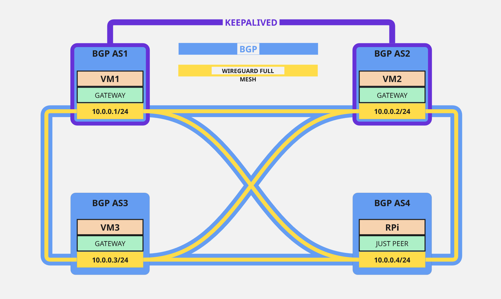

# Failover WireGuard Cluster

A high-availability WireGuard VPN cluster with automatic failover and optimized routing using BGP and keepalived.

## Architecture

The project implements a resilient VPN infrastructure consisting of:

- **Four nodes**:
    - **VM1**: Public IP address (gateway node)
    - **VM2**: Public IP address (gateway node)
    - **VM3**: Public IP address (gateway node)
    - **RPi**: Private IP address (NAT) (peer node)
- **Full Mesh WireGuard Network**: Every node connects to every other node for maximum redundancy
- **BGP Dynamic Routing**: Optimizes packet routing between peers automatically
- **Keepalived High Availability**: Ensures automatic failover when nodes become unavailable
